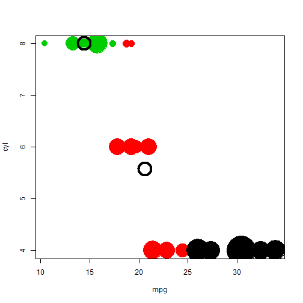

Exploring mtcars via k-means clustering
Coursera Data Products--Final Assigment
========================================================
author: Victor Bernal
date: Mon Sep 30 16:22:26 2019 
autosize: true
[victor-bernal.weebly.com] (http://victor-bernal.weebly.com)

First Slide 
========================================================
title: false
transition: rotate
The mtcars data comes from the 1974 Motor Trend US magazine. It presents 32 vehicles, with some design/ and performance features. We want to explore how these features separate automobile in classes!

========================================================
title: false
transition: zoom

```r
head(mtcars[,c(1:3)])
```

```
                   mpg cyl disp
Mazda RX4         21.0   6  160
Mazda RX4 Wag     21.0   6  160
Datsun 710        22.8   4  108
Hornet 4 Drive    21.4   6  258
Hornet Sportabout 18.7   8  360
Valiant           18.1   6  225
```

========================================================
title: false
transition: fade

```r
clusters<-kmeans(mtcars[, c(1,2)], 3)
        plot(mtcars[, c(1)],mtcars[, c(2)],
             col = clusters$cluster,
             pch = 20, cex = 3*(scale(mtcars[,5])+2),
             xlab=colnames(mtcars)[1], ylab=colnames(mtcars)[2])
        points(clusters$centers, pch = 1, cex = 4, lwd = 4)
```


========================================================
title: false
transition: fade


